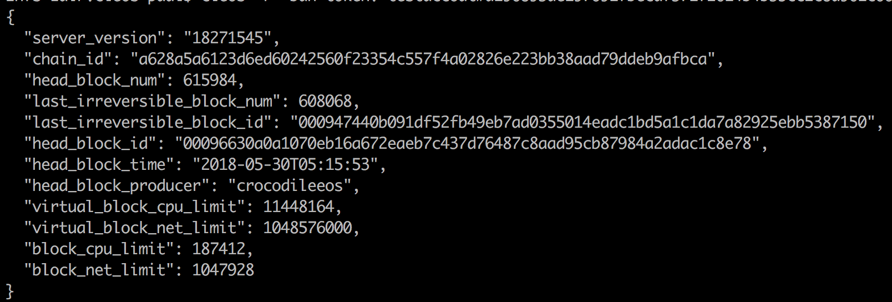
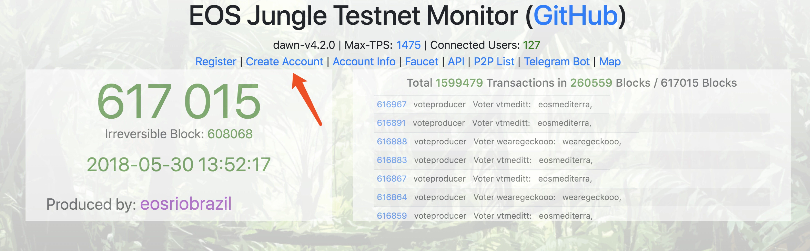
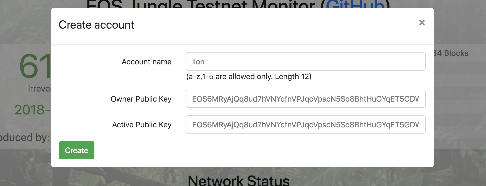
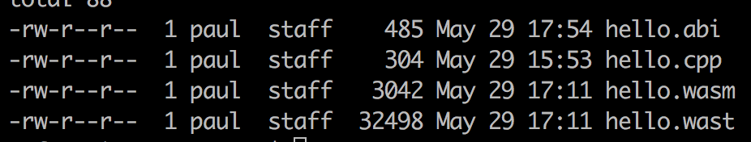
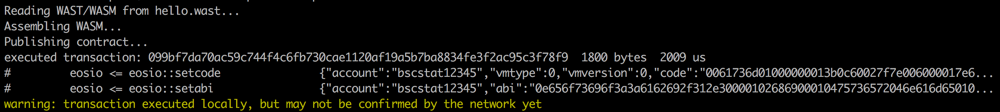
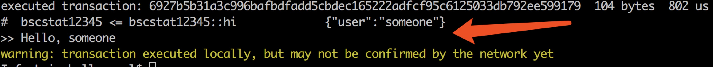

# Overview

BAN, Blockchain Accelerating Network, is an accelerating network published by BaishanCloud. BAN is mainly used for public blockchain platform. BAN provides a network with many geographically located EOS nodes - thus Dapps (Decentralized Applications) can accomplish a fast access to the APIs provided by these full EOS nodes in BAN services. Dapps then can use these APIs to query block info, publish smart contract and push transactions to EOS network. In the remaining part of this guide, we will demonstrate BAN services to you with the EOS official `cleos` command line tool.

# Basic Steps of Using BAN

It's quite straightforward to use BAN service.
Connect to BAN domain in Dapp -> Use the blockchain network

# Domains in BAN

Currently BAN only supports EOS blockchain and it simultaneously provides two domains for access of EOS mainnet and JungleTestnet respectively: 

* EOS mainnet API: https://eos.oasisgo.net:3852
* EOS JungleTestnet: https://eos-test.oasisgo.net:3852

# One Example of Deploying EOS Smart Contract with BAN

## Test the BAN Domains

In this example, we use an EOS testnet - JungleTestnet. So we need to use the test domain of BAN service.

All APIs provided by BAN are exactly the same as the EOS APIs, so when doing the test one can choose whatever methods he or she prefers. In this guide, we utilize the EOS official command line tool `cleos` to demonstrate the steps of connecting to JungleTestnet.

Note: the installation of `cleos` will not be covered in this guide, please refer to EOS documentation for details: [building-eosio](https://github.com/EOSIO/eos/wiki/Local-Environment#2-building-eosio)

One typical usage of `cleos` with BAN is as follows:


```
cleos -u https://ban-test-api.baishancloud.com:3852 get info
```

Description:

* `-u` option is used to specify the address of blockchain API, here we need to specify the BAN testnet domain, which is [https://ban-test-api.baishancloud.com:3852](https://ban-test-api.baishancloud.com:3852)
Note: BAN provides only HTTPS access.
* `get info` is another option of `cleos`，which is used to query the current generic information of the blockchain network.

After the above command has been invoked, there should be similar results like:



This indicates that JungleTestnet is connected and is ready to use.

## Deploy EOS Smart Contract via BAN

### Create Account on JungleTestnet

Because EOS has the term "account", so before deploying a smart contract you need to obtain an usable account and related keys. For the details of account and wallet stuffs in EOS, please refer to the documentation provided by EOS: [Accounts & Permissions](https://github.com/EOSIO/eos/wiki/Accounts%20%26%20Permissions)

Since BAN currently connects to JungleTestnet, the creation of an EOS account is a bit different. On JungleTestnet, users need to go to their website [http://dev.cryptolions.io/](http://dev.cryptolions.io/) and click the "Create Account" link as follows:



Then you need to fill in necessary information into the form and finally click the Create button, then one account will be created on Jungle Testnet



### Create a Smart Contract

We now follow the example given by EOS.io to create a smart contract.

Firstly, create a new directory with the name 'hello', and then create a C++ source file 'hello.cpp' - it's obvious that smart contract in EOS is developed by C++ - finally put the following code into the newly created C++ source file:

```
#include <eosiolib/eosio.hpp>
#include <eosiolib/print.hpp>
using namespace eosio;
 
class hello : public eosio::contract {
  public:
      using contract::contract;
 
      /// @abi action
      void hi( account_name user ) {
         print( "Hello, ", name{user} );
      }
};
 
EOSIO_ABI( hello, (hi) )
```

This is a very simple smart contract which defines a method called `hello::hi` that outputs the name of its parameter.

Then we need to compile this piece of code. We utilize the `eosiocpp` tool shipped together when you build the EOS software from source code.

```
$ eosiocpp -o hello.wast hello.cpp
```

And generate the ABI file:

```
$ eosiocpp -g hello.abi hello.cpp
Generated hello.abi
```

In directory 'hello' we will have the following file:



Thus now the smart contract files are well prepared.

Note: `eosiocpp` is built along with other EOS software and tools. Because smart contract code need to include several EOS header files, to be convenient, please follow the EOS.io requests, that is to say, install the EOS binary files and headers into standard system locations. For instance, in a typical Linux environment, those artifacts are installed into `/usr/local` directory. This will make compiling the smart contract easier.

### Deploy Smart Contract to Blockchain

From now on, we will use the account created in previous section. So you need to make sure the wallet which contains the relevant private keys is in the unlock status (Use `cleos wallet unlock` command, please refer to EOS.io documentation for details).

In our example, we suppose the account name as `bscstat12345` (You need to replace this with your own account name). Deploy the smart contract as follows:

```
cleos -u https://ban-test-api.baishancloud.com:3852 set contract bscstat12345 ../hello hello.wast hello.abi
```

If the command executes successfully, it will return results like this:



If you encounter some errors while deploying the contract, it probably is something wrong with the account itself, then please refer to the account and permissions section in EOS.io's documentation.

### Send a Transaction and Call the Contract

After the contract is deployed, we can use the following command to invoke the `hi` method in the contract:

```
cleos -v -u https://ban-test-api.baishancloud.com:3852 push action bscstat12345 hi '["someone"]' -p bscstat12345
```

It will return something like this if successfully:



The like pointed by the red arrow indicates that the `hi` method is executed successfully thus the output of the parameter's name is printed there as "Hello, someone".
