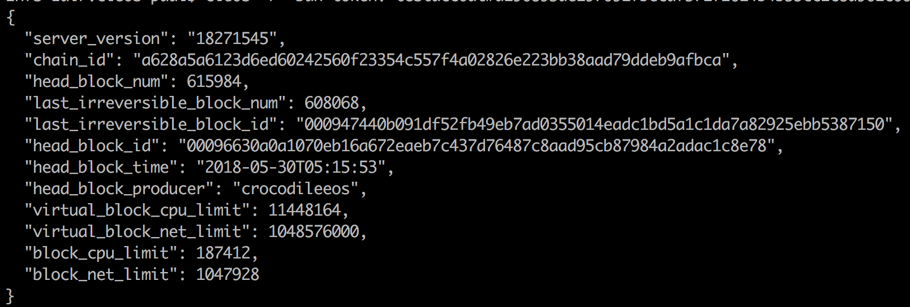
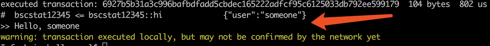

# 概述

BAN，Blockchain Accelerating Network，是白山云针对公有区块链网络而设计的一种加速网络服务。BAN服务按照地理位置分布提供了数量众多的EOS全节点，这样Dapp（去中心化应用程序）可以实现快速的连接到这些全节点所提供的区块链API，并使用这些API完成信息查询、智能合约发布以及交易推送等动作。本文接下来将基于EOS官方的`cleos`命令行工具，对如何使用BAN服务实现Dapp的快速API调用进行介绍，使大家对BAN服务有个直观的认识。

# 使用BAN服务的基本流程

在Dapp中连接BAN服务的域名 → 使用区块链网络

# BAN服务域名

当前BAN服务只支持EOS区块链，并提供EOS主网和测试网络两种API接入域名：

* EOS主网API:
	* https://ban-api.baishancloud.com:3852
* EOS测试网络JungleTestnet:
	* https://ban-test-api.baishancloud.com:3852

# 使用BAN进行EOS常用操作的例子

注：钱包相关操作属于用户的本地操作（钱包的创建、解锁，密钥对的创建、导入等），或者属于Dapp本身的业务逻辑，和BAN服务不发生直接联系，不属于通过BAN服务可以完成的操作，因此本文档中不涉及对钱包相关操作的描述。如需关于钱包操作的详细请参考

以下部分示例来源于[这里](https://note.youdao.com/share/index.html?id=93c626b6060e73d78ba5a8f8559d1ddb&type=note&from=groupmessage&isappinstalled=0#/)

## 创建账户

使用account1创建account2账户：

```
cleos -u https://ban-api.baishancloud.com:3852 system newaccount --transfer --stake-net "100.0000 EOS" --stake-cpu "100.0000 EOS" --buy-ram "100.0000 EOS" account1 account2
```

## EOS转账

```
cleos -u https://ban-api.baishancloud.com:3852 transfer account1 account2 "100.0000 EOS"
```

## 账户查询

```
cleos -u https://ban-api.baishancloud.com:3852 get account account1
cleos -u https://ban-api.baishancloud.com:3852 get account account2
```

## 账户余额查询

```
cleos -u https://ban-api.baishancloud.com:3852 get currency balance eosio.token account1
cleos -u https://ban-api.baishancloud.com:3852 get currency balance eosio.token account2
```

## 使用eosio.token合约创建新token

```
cleos -u https://ban-api.baishancloud.com:3852 push action eosio.token create '["account1", "1000000000.0000 EN"]' -p eosio.token
```

## 发行Token

```
cleos -u https://ban-api.baishancloud.com:3852 push action eosio.token issue '["account1", "1000000000.0000 EN", "memo"]' -p account1
```

## 查询Token余额

```
cleos -u https://ban-api.baishancloud.com:3852 get currency balance eosio.token account1
```

## 查看BP列表

```
cleos -u https://ban-api.baishancloud.com:3852 system listproducers
```

## 投票

```
cleos -u https://ban-api.baishancloud.com:3852 system voteproducer prods account1 candidate1
```

## 买卖内存

```
cleos system buyram account1 account1 "100.0000 EOS" -p account1
cleos system sellram account1 1048576
```

# 一个使用BAN部署智能合约的例子

## 测试BAN网络服务域名

本例子中使用的是EOS的测试网络 - JungleTestnet，因此需要通过BAN服务的Test API进行演示。

BAN对外提供的API和EOS的官方API完全一致，因此在进行测试的时候可以自主选择API的调用方式，本文将使用EOS官方工具`cleos`来演示对通过BAN服务连接JungleTestnet的步骤。

注：`cleos`的编译安装方式本文不再赘述，请参考EOS的官方文档：[building-eosio](https://github.com/EOSIO/eos/wiki/Local-Environment#2-building-eosio)

一个典型的使用`cleos`命令行工具连接BAN的方式如下所示：

```
cleos -u https://ban-test-api.baishancloud.com:3852 get info
```

说明：

* -u 参数用于设置要连接的区块链API地址，这里使用BAN服务指定的域名和端口，即
[https://ban-test-api.baishancloud.com:3852](https://ban-test-api.baishancloud.com:3852)
注：目前BAN服务只提供基于HTTPS的访问，不支持明文访问
* `get info`是`cleos`的选项，用于查询当前区块链网络的基本状态

执行上述命令后，将会得到类似下面的查询结果



由此可以开始正常使用JungleTestnet，并得到BAN服务的快速接入。

## 通过BAN部署智能合约

###JungleTestnet账户创建
由于EOS区块链是基于“账户”的，因此在部署智能合约之前，你先需要有一个可用的账户并在本地钱包中创建对应的密钥，关于账户和钱包的设置，请参考EOS官方文档：[Accounts & Permissions](https://github.com/EOSIO/eos/wiki/Accounts%20%26%20Permissions)

但是由于BAN目前是基于JungleTestnet的，因此账户的创建又有所不同，在JungleTestnet上创建账户，需要在其所提供的网站页面进行操作：[http://dev.cryptolions.io/](http://dev.cryptolions.io/) ，访问该URL后，点击其中的“Create Account"连接：


按照要求填写账户相关信息（主要是填写权限相关的公钥），点击Create按钮，就可以实现账户的创建。


需要注意的是，账户名称最好是12个字符长度。

### 生成智能合约
我们现在使用EOS的官方例子来创建一个智能合约。

首先创建一个目录，名为hello，然后在其中创建hello.cpp文件，很明显，目前EOS的智能合约要求使用C++语言进行开发，在此hello.cpp文件中粘贴如下代码：

```
#include <eosiolib/eosio.hpp>
#include <eosiolib/print.hpp>
using namespace eosio;
 
class hello : public eosio::contract {
  public:
      using contract::contract;
 
      /// @abi action
      void hi( account_name user ) {
         print( "Hello, ", name{user} );
      }
};
 
EOSIO_ABI( hello, (hi) )
```

这段代码是一个非常简单的智能合约代码，其作用是定义了一个名为`hello::hi`的方法，然后在此方法中输出参数名称。

然后对这段合约代码进行编译处理。编译的时候我们使用EOS官方提供的`eosiocpp`工具：

```
$ eosiocpp -o hello.wast hello.cpp
```

并生成ABI文件：

```
$ eosiocpp -g hello.abi hello.cpp
Generated hello.abi
```

这样的话，在hello目录中，将会存在如下几个文件：


这样智能合约文件就都准备好了。

注意：`eosiocpp`工具随EOS代码一起发布，因为编译智能合约需要引用EOS的若干头文件，因此为了方便，请按照官方要求，将编译后的EOS二进制文件和头文件等相关产物install至系统标准目录下，例如，在Linux中，这些内容将被安装到`/usr/local`下，确保有足够的权限进行此操作。然后eosiocpp会自动判断头文件的位置。如果编译智能合约存在问题，请参考EOS官方手册。

### 部署智能合约到区块链
从这个步骤开始，将会使用的之前创建的账户，并且务必保证包含此账户私钥的钱包是属于解锁状态（使用`cleos wallet unlock`，具体请参考EOS文档中关于钱包操作的说明）

我们的例子中，假设账户名为`bscstat12345`（此处需替换成你之前申请的账户名称），下面用此账户部署智能合约：

```
cleos -u https://ban-test-api.baishancloud.com:3852 set contract bscstat12345 ../hello hello.wast hello.abi
```

如果执行成功，则会返回类似于如下的信息：


如果无法成功部署合约，大部分是因为账户的问题，请参考EOS官方手册中对账户和权限的说明。

### 发起交易调用智能合约
在智能合约成功部署之后，可以用如下方式对合约中的`hi`方法进行调用：

```
cleos -v -u https://ban-test-api.baishancloud.com:3852 push action bscstat12345 hi '["someone"]' -p bscstat12345
```

调用成功后会返回类似如下信息：



其中红色箭头所指部分表示合约进行了执行已经可以看到执行结果”Hello, someone"。
