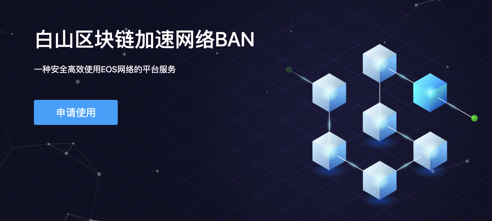

# 概述

BAN，Blockchain Accelerating Network，是白山云针对公有区块链网络而设计的一种加速网络服务。BAN服务按照地理位置分布提供了数量众多的EOS全节点，这样Dapp（去中心化应用程序）可以实现快速的连接到这些全节点所提供的区块链API，并使用这些API完成信息查询、智能合约发布以及交易推送等动作。本文接下来将基于EOS官方的`cleos`命令行工具，对如何使用BAN服务实现Dapp的快速API调用进行介绍，使大家对BAN服务有个直观的认识。

关于BAN服务的技术细节，请参考[BAN技术白皮书](https://github.com/baishancloud/ban/wiki/BAN%E6%8A%80%E6%9C%AF%E7%99%BD%E7%9A%AE%E4%B9%A6)

# 使用BAN服务的基本流程

用户申请试用 → 获取Access Token → 在Dapp中带Token访问BAN → 使用区块链网络

# 申请BAN Access Token

首先需要在[https://BAN.baishancloud.com](https://ban.baishancloud.com)中点击“申请试用”按钮：



并正确填写相关信息后，点击提交。

申请成功之后，我们会将Access Token发送到你的电子邮件地址，一个有效的Token类似如下形式：

```
testaccount#d196893de197091fbecaf371f2614b4b35cc2c8d961c0018
```

# BAN服务域名

当前BAN服务支持比特币，以太坊和EOS：

* Bitcoin
	* https://btc.oasisgo.net:3852
* Ethereum
	* Ethereum主网
		* https://eth.oasisgo.net:3852
* EOS
	* EOS主网API:
		* https://eos.oasisgo.net:3852

# 使用Token连接BAN

在成功获取Token之后，就可以连接并使用BAN服务，包括上述的三个域名。在通过HTTP API连接BAN服务的时候，需要在HTTP请求中带有形式为：

```
ban-token: testaccount#d196893de197091fbecaf371f2614b4b35cc2c8d961c0018
```

的HTTP请求头，其中ban-token为请求头的名字，其值为从BAN官网申请到的Access Token。

以EOS的`cleos`命令行为例：

```
cleos -r "ban-token: testaccount#d196893de197091fbecaf371f2614b4b35cc2c8d961c0018" -u https://eos.oasisgo.net:3852 get info
```

说明：

* `-r`参数用于设置发送HTTP请求时的请求头，BAN要求全部的区块链API请求需要带有名为`ban-token`的HTTP请求头，其值为之前申请的合法BAN Access Token
* -u 参数用于设置要连接的区块链API地址，这里使用BAN服务指定的域名和端口，即 [https://eos.oasisgo.net:3852](https://eos.oasisgo.net:3852)
注：目前BAN服务只提供基于HTTPS的访问，不支持明文访问
* `get info`是`cleos`的选项，用于查询当前区块链网络的基本状态

对于BTC和ETH也是同理，需要在Dapp访问BAN服务域名的时候加上上述ban-token的HTTP请求头。

# 延伸阅读

[EOS基础使用指南](EOS.md)
