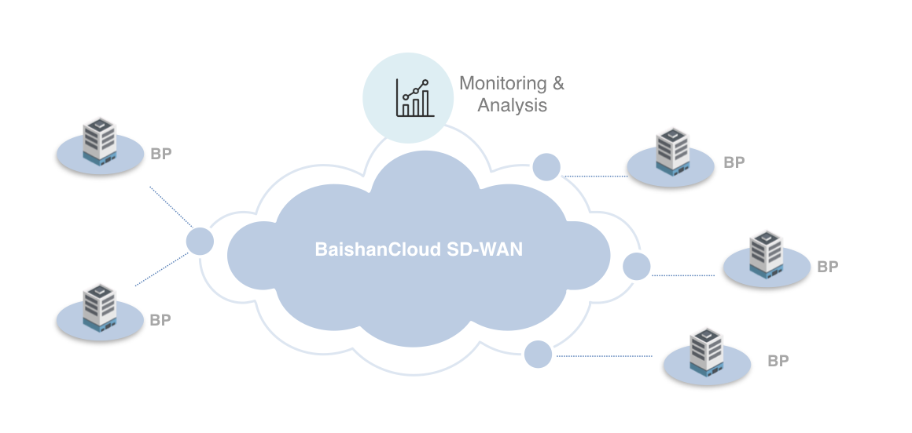

# SDWAN for EOS Block Producer

## Introduction to SDWAN

Software Defined Wide Area Network, abbreviated by SDWAN, is a technique to stabilize and accelerate the connections between geographically distributed IT infrastructures. SDWAN can save lots of work struggling at how to conquer the connectivity problems in a WAN scenario. And also, SDWAN usually uses encrypted connections among entities connecting to the network, so the data is also well protected in SDWAN while traveling. BaishanCloud provids SDWAN service for its customers globally and its SDWAN is a better VPN solution.

## EOS Block Producer

As mentioned by EOS.io, there will be 21 Block Producers (abbr. BP) and 100 backup BPs as designed. Those BPs need to provide adequate computing, networking and security resources to achieve the goal of block producing. As you can see, BP plays a very important role in the EOS.io network. The efficiency of BPs decide the efficiency of the whole network, including the 'transaction per second' which is considered as the vital part of a blockchain nowadays.

Block Producers need to communicate frequently among themselves to sign blocks while a new block is produced by one of the 21 BPs. Based on the 'voting' mechanism for how BPs are elected. Unfortunately, EOS Block Producers might not be gathered in a centralized location. In contrast, at a very high probability, BPs are distributed geographically, across countries and continents. This makes it even harder for the BPs to communicate fast against each other.

Apparently, BPs need a solution to deal with this situation.

## A Feasible Solution

Using SDWAN to accelerate the communication among distributed IT infrastructures has been proved long time ago. EOS BPs are just that kind of IT infrastructures so we could easily reach to a conclusion - SDWAN can be used to accelerate and stabilize the communications among EOS BPs.

A typical EOS BPs utilizing a SDWAN could be probably illustrated as this:

EOS BP nodes connect to the access points of SDWAN. The SDWAN then serves the network traffics among all BP nodes and find the quickest path for the data traveling across. Besides the SDWAN provides also operating monitors for all BPs to check the status of the network.

By applying such a architecture to the inter-continent communication, the speed will be accelerated by 2 to 10 times than direct connection. And meanwhile the latency of communication reduces enormously either.

## Advantages of BaishanCloud SDWAN

Talking about what makes BaishanCloud SDWAN more suitable for EOS BPs, I think there are several points you need to know.

### Globally Distributed Nodes

As you can see in the above image, BaishanCloud has SDWAN nodes all over the world. In details, BaishanCloud has nodes locate in more than 400 cities globally, more than 100 of which locate outside China mainland. Almost in every country you can find an access point of BaishanCloud SDWAN. This guarantees no matter where your BP nodes are, you can always get accelerated by the SDWAN.

### Smart Protocol Adaption

BaishanCloud SDWAN can choose which transmission protocol to use based on the network type. BaishanCloud SDWAN supports a customized UDP-based protocol which is used inside the whole SDWAN. This private protocol provides high speed transmission capability.

### RL-Based Routing Algorithm

Reinforcement Learning is applied to create the routing algorithm in BaishanCloud SDWAN. This autonomous algorithm can adapt to the network very well - even the network topology would be very complicated. Thanks to the cutting edge AI technology, users of BaishanCloud SDWAN have no more need to bother with the annoying network administration works.

### Port Reuse Technique

The exclusive port reuse technique provided by BaishanCloud SDWAN will allow the network traffic still stay usable even the system is upgrading or switching underlying links. This is vital for the 'serious' business in where people care about the stability of the network.

## Why not Other Solutions?

Well, there are some similar techniques but all of them have shortages compared to SDWAN. Let's summarize as follows:

Index | Public Network | VPN | MPLS | BSC SDWAN
------|----------------|-----|------|-----------
Private Network|No|Yes|Yes|Yes
WAN Optimization|Yes|Yes|No|Yes
Smart Routing|No|No|Yes|Yes
TCP Optimization|No|No|No|Yes
Elastic Bandwidth|Yes|Yes|No|Yes
Instant Deployment|No|No|No|Yes
Price|Very Low|Low|High|Low
